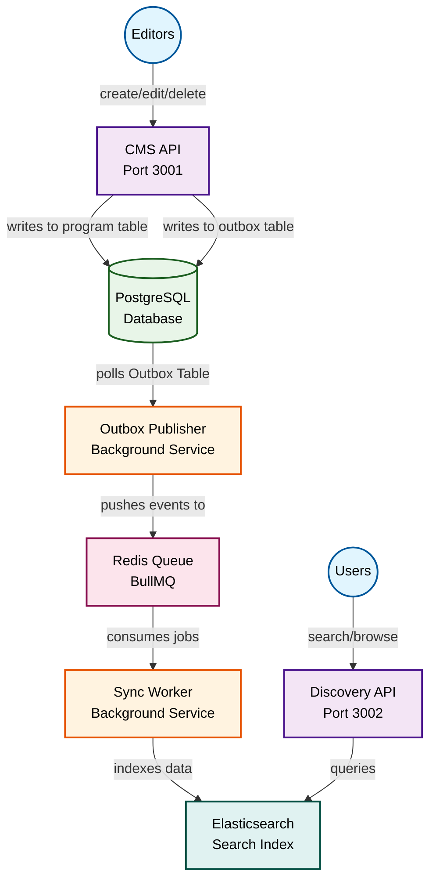

# 🚀 Thmanyah Backend System

[](https://nodejs.org/)
[](https://www.typescriptlang.org/)
[](https://nestjs.com/)
[](LICENSE)
[](https://pnpm.io/)

A modular, scalable backend system for managing and discovering media content (podcasts, documentaries, etc.) built with NestJS, TypeScript, and modern microservices architecture.

## 🌐 Live Demo

**🚀 Working APIs deployed on AWS ECS:**

- **CMS API Documentation**: [http://thmanyah-backend-dev-alb-298183992.us-east-1.elb.amazonaws.com:3001/reference](http://thmanyah-backend-dev-alb-298183992.us-east-1.elb.amazonaws.com:3001/reference)
- **Discovery API Documentation**: [http://thmanyah-backend-dev-alb-298183992.us-east-1.elb.amazonaws.com:3002/reference](http://thmanyah-backend-dev-alb-298183992.us-east-1.elb.amazonaws.com:3002/reference)
- **Health Checks**:
  - CMS API: [http://thmanyah-backend-dev-alb-298183992.us-east-1.elb.amazonaws.com:3001/v1/health](http://thmanyah-backend-dev-alb-298183992.us-east-1.elb.amazonaws.com:3001/v1/health)
  - Discovery API: [http://thmanyah-backend-dev-alb-298183992.us-east-1.elb.amazonaws.com:3002/v1/health](http://thmanyah-backend-dev-alb-298183992.us-east-1.elb.amazonaws.com:3002/v1/health)

## 📋 Table of Contents

- [🚀 Thmanyah Backend System](#-thmanyah-backend-system)
  - [📋 Table of Contents](#-table-of-contents)
  - [🏗️ Architecture](#️-architecture)
    - [System Architecture Diagram](#system-architecture-diagram)
  - [🛠️ Tech Stack](#️-tech-stack)
  - [📦 Shared Packages](#-shared-packages)
  - [🚀 Quick Start](#-quick-start)
    - [Prerequisites](#prerequisites)
    - [1. Clone and Install](#1-clone-and-install)
    - [2. Environment Setup](#2-environment-setup)
    - [3. Start Infrastructure](#3-start-infrastructure)
    - [4. Database Setup](#4-database-setup)
    - [5. Build and Run](#5-build-and-run)
  - [🚀 Quick Start (Local Development)](#-quick-start-local-development)
    - [1. Clone and Setup](#1-clone-and-setup)
    - [2. Start Everything](#2-start-everything)
  - [🌐 Live URLs](#-live-urls)
    - [Development Environment](#development-environment)
    - [Production Environment](#production-environment)
    - [Health Checks](#health-checks)
    - [API Documentation](#api-documentation)
  - [📚 API Documentation](#-api-documentation)
  - [🔧 Development](#-development)
    - [Available Scripts](#available-scripts)
    - [Project Structure](#project-structure)
    - [Environment Variables](#environment-variables)
      - [Core Configuration](#core-configuration)
      - [CORS Configuration](#cors-configuration)
      - [OpenAPI/Swagger Configuration](#openapiswagger-configuration)
      - [Security \& Rate Limiting](#security--rate-limiting)
      - [Logging \& Monitoring](#logging--monitoring)
      - [Database SSL](#database-ssl)
  - [🔄 Data Flow](#-data-flow)
  - [🧪 Testing](#-testing)
  - [🚀 Production Deployment](#-production-deployment)
    - [Environment Variables](#environment-variables-1)
    - [Deployment Options](#deployment-options)
      - [Option 1: Docker Deployment](#option-1-docker-deployment)
      - [Option 2: Direct Deployment](#option-2-direct-deployment)
      - [Option 3: Individual Service Deployment](#option-3-individual-service-deployment)
      - [Option 4: AWS ECS Deployment](#option-4-aws-ecs-deployment)
  - [📊 Monitoring](#-monitoring)
  - [🔒 Security Features](#-security-features)
  - [🚀 Performance Features](#-performance-features)
  - [🤝 Contributing](#-contributing)
    - [Development Guidelines](#development-guidelines)
  - [📄 License](#-license)
  - [🆘 Support](#-support)
  - [🔗 Related Links](#-related-links)

## 🏗️ Architecture

The system consists of 4 main services:

- **CMS API** (`apps/cms-api`) - Internal API for editors to create/edit content
- **Discovery API** (`apps/discovery-api`) - Public API for searching and viewing content
- **Outbox Publisher** (`apps/outbox-publisher`) - Polls database and pushes events to queue
- **Sync Worker** (`apps/sync-worker`) - Consumes queue jobs and syncs to Elasticsearch

### System Architecture Diagram



## 🛠️ Tech Stack

- **Framework**: NestJS + TypeScript
- **Database**: PostgreSQL + TypeORM
- **Queue**: Redis + BullMQ
- **Search**: Elasticsearch
- **Monorepo**: Turborepo
- **Package Manager**: pnpm (workspaces)
- **Testing**: Jest + Supertest
- **Documentation**: Swagger/OpenAPI
- **Deployment**: Docker + AWS ECS

## 📦 Shared Packages

- `@thmanyah/database` - TypeORM entities and database module
- `@thmanyah/queue` - BullMQ queue setup and job types
- `@thmanyah/elasticsearch` - ES client and index helpers
- `@thmanyah/config` - Environment configuration with Zod validation
- `@thmanyah/common` - Shared NestJS components, interceptors, filters, and configuration
- `@thmanyah/shared` - Common interfaces and types for APIs and data models

## 🚀 Quick Start

### Prerequisites

- Node.js 18+
- pnpm 9.0+
- Docker & Docker Compose
- Git

### 1. Clone and Install

```bash
git clone <repository-url>
cd thmanyah-backend
pnpm install
```

### 2. Environment Setup

Create a `.env` file in the root directory:

```bash
# Environment
NODE_ENV=development

# Database
DATABASE_HOST=localhost
DATABASE_PORT=5432
DATABASE_USERNAME=postgres
DATABASE_PASSWORD=password
DATABASE_NAME=thmanyah

# Redis
REDIS_HOST=localhost
REDIS_PORT=6379
REDIS_PASSWORD=

# Elasticsearch
ELASTICSEARCH_URL=http://localhost:9200
ELASTICSEARCH_USERNAME=elastic
ELASTICSEARCH_PASSWORD=changeme
ELASTICSEARCH_INDEX_NAME=programs

# API Ports
CMS_API_PORT=3001
DISCOVERY_API_PORT=3002

# Security (Optional)
CORS_ORIGINS=http://localhost:3000,http://localhost:3001,http://localhost:3002
CORS_ALLOWED_HEADERS=Content-Type,Authorization,X-Requested-With,x-request-id,x-api-version

# OpenAPI/Swagger Configuration (Optional)
CMS_API_SERVER_URL=http://localhost:3001
DISCOVERY_API_SERVER_URL=http://localhost:3002
CMS_API_SERVER_DESCRIPTION=Development server
DISCOVERY_API_SERVER_DESCRIPTION=Development server

# Logging & Monitoring (Optional)
LOG_LEVEL=log
REQUEST_ID_HEADER=x-request-id

# Database SSL (Optional)
DATABASE_SSL_DISABLED=true
```

### 3. Start Infrastructure

```bash
# Start PostgreSQL, Redis, and Elasticsearch
docker-compose up -d

# Optional: Start Kibana for Elasticsearch management
docker-compose --profile monitoring up -d
```

### 4. Database Setup

```bash
# Run database migrations
pnpm db:migrate

# Optional: Generate new migration
pnpm db:migrate:generate

# Optional: Sync database schema
pnpm db:schema:sync
```

### 5. Build and Run

```bash
# Build all packages
pnpm build

# Start all services in development mode
pnpm dev

# Or start individual services
pnpm --filter cms-api dev
pnpm --filter discovery-api dev
pnpm --filter outbox-publisher dev
pnpm --filter sync-worker dev
```

## 🚀 Quick Start (Local Development)

For a faster local development setup, follow these simplified steps:

### 1. Clone and Setup

```bash
git clone <repository-url>
cd thmanyah-backend

# Copy environment file
cp env.example .env

# Install dependencies (this automatically runs setup:env)
pnpm install
```

### 2. Start Everything

```bash
# Start infrastructure (PostgreSQL, Redis, Elasticsearch)
docker-compose up -d

# Start all services in development mode
pnpm dev
```

That's it! 🎉

- **CMS API**: http://localhost:3001/api
- **Discovery API**: http://localhost:3002/api
- **Health Checks**: http://localhost:3001/health, http://localhost:3002/health

> **Note**: The `pnpm install` command automatically runs `pnpm build:packages && pnpm setup:env`, which builds shared packages and creates environment symlinks for all apps.

> **Optional**: If you need to run database migrations manually, use `pnpm db:migrate`.

## 🌐 Live URLs

Once deployed to AWS using Terraform, you can access the live services:

### Development Environment

```bash
# Get the ALB DNS name from Terraform outputs
terraform -chdir=terraform/environments/dev output alb_dns_name

# Then access the services at:
# CMS API: http://<alb-dns-name>:3001
# Discovery API: http://<alb-dns-name>:3002
```

**Current Dev URLs:**

- **CMS API**: http://thmanyah-backend-dev-alb-298183992.us-east-1.elb.amazonaws.com:3001
- **Discovery API**: http://thmanyah-backend-dev-alb-298183992.us-east-1.elb.amazonaws.com:3002

### Production Environment

```bash
# Get the ALB DNS name from Terraform outputs
terraform -chdir=terraform/environments/prod output alb_dns_name

# Then access the services at:
# CMS API: http://<alb-dns-name>:3001
# Discovery API: http://<alb-dns-name>:3002
```

### Health Checks

- **CMS API Health**: http://thmanyah-backend-dev-alb-298183992.us-east-1.elb.amazonaws.com:3001/health
- **Discovery API Health**: http://thmanyah-backend-dev-alb-298183992.us-east-1.elb.amazonaws.com:3002/health

### API Documentation

- **CMS API Swagger**: http://thmanyah-backend-dev-alb-298183992.us-east-1.elb.amazonaws.com:3001/reference
- **Discovery API Swagger**: http://thmanyah-backend-dev-alb-298183992.us-east-1.elb.amazonaws.com:3002/reference

> **Note**: Replace `<alb-dns-name>` with the actual Application Load Balancer DNS name from your Terraform outputs.

## 📚 API Documentation

Once running, you can access the Swagger documentation:

- **CMS API**: http://localhost:3001/api
- **Discovery API**: http://localhost:3002/api

## 🔧 Development

### Available Scripts

```bash
# Build all packages
pnpm build

# Build only packages (not apps)
pnpm build:packages

# Type checking
pnpm check-types

# Linting
pnpm lint

# Development mode (all services)
pnpm dev

# Clean all builds and dependencies
pnpm clean

# Monorepo validation
pnpm monorepo:check
pnpm monorepo:fix

# Production start
pnpm start:prod

# Format code
pnpm format

# Database operations
pnpm db:migrate
pnpm db:migrate:generate
pnpm db:migrate:revert
pnpm db:schema:sync

# Docker operations
pnpm docker:build
pnpm docker:up
pnpm docker:down
pnpm docker:logs
```

### Project Structure

```
thmanyah-backend/
├── apps/
│   ├── cms-api/             # Internal CMS app
│   │   ├── src/
│   │   │   ├── program/     # Program management
│   │   │   ├── health/      # Health checks
│   │   │   └── common/      # Shared utilities
│   │   └── test/            # E2E tests
│   ├── discovery-api/       # Public search app
│   │   ├── src/
│   │   │   ├── search/      # Search functionality
│   │   │   ├── health/      # Health checks
│   │   │   └── common/      # Shared utilities
│   │   └── test/            # E2E tests
│   ├── outbox-publisher/    # Polls DB, pushes jobs
│   │   ├── src/
│   │   │   └── outbox-publisher/  # Outbox logic
│   │   └── test/            # E2E tests
│   └── sync-worker/         # Consumes queue, syncs ES
│       ├── src/
│       │   └── sync-worker/ # Sync logic
│       └── test/            # E2E tests
├── packages/
│   ├── database/            # Shared TypeORM entities
│   │   ├── entities/        # Database entities
│   │   ├── migrations/      # Database migrations
│   │   └── services/        # Database services
│   ├── queue/               # BullMQ queue setup
│   ├── elasticsearch/       # ES client & helpers
│   ├── config/              # Shared config utils
│   ├── common/              # NestJS interceptors, filters & config
│   └── shared/              # Common interfaces & types
├── terraform/               # Infrastructure as Code
├── docker-compose.yml       # Local infrastructure
└── turbo.json               # Turborepo config
```

### Environment Variables

The system supports comprehensive environment-based configuration. See `env.example` for all available options:

#### Core Configuration

- `NODE_ENV` - Environment (development/production/test)
- `DATABASE_*` - PostgreSQL connection settings
- `REDIS_*` - Redis connection settings
- `ELASTICSEARCH_*` - Elasticsearch connection settings
- `CMS_API_PORT` / `DISCOVERY_API_PORT` - Service ports

#### CORS Configuration

- `CORS_ORIGINS` - Comma-separated list of allowed origins
- `CORS_ALLOWED_HEADERS` - Comma-separated list of allowed headers

#### OpenAPI/Swagger Configuration

- `CMS_API_SERVER_URL` / `DISCOVERY_API_SERVER_URL` - Server URLs for API docs
- `CMS_API_SERVER_DESCRIPTION` / `DISCOVERY_API_SERVER_DESCRIPTION` - Server descriptions

#### Security & Rate Limiting

- `API_RATE_LIMIT` - Number of requests per time window
- `API_RATE_LIMIT_TTL` - Time window in milliseconds
- `JWT_SECRET` - JWT signing secret
- `JWT_EXPIRES_IN` - JWT expiration time

#### Logging & Monitoring

- `LOG_LEVEL` - Logging level (error/warn/log/debug/verbose)
- `REQUEST_ID_HEADER` - Header name for request IDs

#### Database SSL

- `DATABASE_SSL_DISABLED` - Disable SSL for local development

## 🔄 Data Flow

1. **Content Creation**: Editors use CMS API to create/update programs
2. **Outbox Events**: Changes are logged in the outbox table
3. **Queue Processing**: Outbox Publisher polls and pushes events to Redis queue
4. **Search Indexing**: Sync Worker consumes jobs and updates Elasticsearch
5. **Content Discovery**: Users search via Discovery API (Elasticsearch)

## 🧪 Testing

```bash
# Run all tests
pnpm test

# Run tests for specific app
pnpm --filter cms-api test

# E2E tests
pnpm --filter cms-api test:e2e

# Test coverage
pnpm --filter cms-api test:cov

# Watch mode
pnpm test:watch
```

## 🚀 Production Deployment

### Environment Variables

Set appropriate environment variables for production:

```bash
NODE_ENV=production
DATABASE_HOST=your-db-host
DATABASE_PASSWORD=your-secure-password
REDIS_HOST=your-redis-host
ELASTICSEARCH_URL=your-es-url
ELASTICSEARCH_PASSWORD=your-secure-password
CORS_ORIGINS=https://your-frontend-domain.com
```

### Deployment Options

#### Option 1: Docker Deployment

```bash
# Build and run with production environment
docker-compose -f docker-compose.prod.yml up -d

# Or build production images
pnpm docker:build
```

#### Option 2: Direct Deployment

```bash
# Build all packages and apps
pnpm build

# Start production services
pnpm start:prod
```

#### Option 3: Individual Service Deployment

```bash
# Build and start each service individually
pnpm --filter cms-api build && pnpm --filter cms-api start:prod
pnpm --filter discovery-api build && pnpm --filter discovery-api start:prod
pnpm --filter outbox-publisher build && pnpm --filter outbox-publisher start:prod
pnpm --filter sync-worker build && pnpm --filter sync-worker start:prod
```

#### Option 4: AWS ECS Deployment

See the [Terraform documentation](./terraform/README.md) for AWS deployment instructions.

## 📊 Monitoring

- **Elasticsearch**: http://localhost:9200 (direct access)
- **Kibana**: Available via `docker-compose --profile monitoring up -d` (commented out by default)
- **Redis**: Available via Docker extension or `redis-cli -h localhost -p 6379`
- **Health Checks**: Each service exposes `/health` endpoint
- **Application Logs**: Structured logging with request IDs and correlation

## 🔒 Security Features

- Input validation and sanitization
- Rate limiting on API endpoints
- CORS configuration
- Request/response logging
- Error handling with proper HTTP status codes
- Environment-based configuration validation

## 🚀 Performance Features

- Database connection pooling
- Redis caching
- Elasticsearch indexing optimization
- Queue-based asynchronous processing
- Bulk operations support
- Request/response compression

## 🤝 Contributing

1. Fork the repository
2. Create a feature branch (`git checkout -b feature/amazing-feature`)
3. Make your changes
4. Add tests for new functionality
5. Ensure all tests pass (`pnpm test`)
6. Commit your changes (`git commit -m 'Add amazing feature'`)
7. Push to the branch (`git push origin feature/amazing-feature`)
8. Open a Pull Request

### Development Guidelines

- Follow TypeScript best practices
- Use proper error handling
- Add comprehensive tests
- Update documentation
- Follow the existing code style
- Use conventional commit messages

## 📄 License

This project is licensed under the MIT License - see the [LICENSE](LICENSE) file for details.

## 🆘 Support

- **Documentation**: Check the individual service READMEs for detailed information
- **Issues**: Report bugs and feature requests via GitHub Issues
- **Discussions**: Use GitHub Discussions for questions and ideas
- **Contributing**: See the contributing guidelines above

## 🔗 Related Links

- [NestJS Documentation](https://docs.nestjs.com/)
- [TypeORM Documentation](https://typeorm.io/)
- [Elasticsearch Documentation](https://www.elastic.co/guide/index.html)
- [BullMQ Documentation](https://docs.bullmq.io/)
- [Turborepo Documentation](https://turbo.build/repo/docs)
